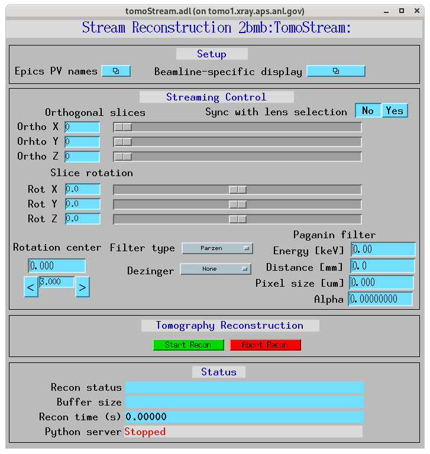
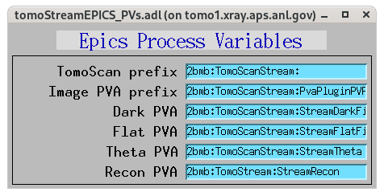

*******************************
tomoStreamApp EPICS application
*******************************

.. 
   toctree::
   :hidden:

   tomoStream.template
   tomoStream_settings.req
   tomoStream.substitutions

tomostream includes a complete example EPICS application, including:

- A database file and corresponding autosave request file that contain only the PVs required by the tomoscan.py base class.
- Database files and corresponding autosave request files that contain PVs used by the derived classes.
- An example IOC application that can be used to run the above databases.
  The databases are loaded in the IOC with the example substitutions file, 
  :doc:`tomoStream.substitutions`.

Base class files
================
The following tables list all of the records in the tomoScan.template file.
These records are used by the tomoscan base class and so are required.

tomoStream.template
-------------------

This is the database file that contains only the PVs required by the tomoscan.py base class
:doc:`tomoStream.template`.

tomoStream PV Prefixes
~~~~~~~~~~~~~~~~~~~~~~

.. cssclass:: table-bordered table-striped table-hover
.. list-table::
  :header-rows: 1
  :widths: 5 5 90

  * - Record name
    - Record type
    - Description
  * - $(P)$(R)TomoScanPVPrefix
    - stringout
    - Contains the prefix for the tomoscan controlling the data collection, e.g. 2bma:TomoScan

tomoStream PVA Names
~~~~~~~~~~~~~~~~~~~~

.. cssclass:: table-bordered table-striped table-hover
.. list-table::
  :header-rows: 1
  :widths: 5 5 90

  * - Record name
    - Record type
    - Description
  * - $(P)$(R)ImagePVAPName
    - stringout
    - Contains the name of the TomoScan PV storing the PV prefix of the images streamed by the detector
  * - $(P)$(R)DarkPVAName
    - stringout
    - Contains the name of the TomoScan PVA where the dark images are stored
  * - $(P)$(R)FlatPVAName
    - stringout
    - Contains the name of the TomoScan PVA where the flat images are stored
  * - $(P)$(R)ThetaPVAName
    - stringout
    - Contains the name of the TomoScan PVA where the rotation angle positions are stored
  * - $(P)$(R)ReconPVAName
    - stringout
    - Contains the name of the TomoStream PVA where the the selected 3 orthogonal slices are stored

Streaming analysis control
~~~~~~~~~~~~~~~~~~~~~~~~~~

.. cssclass:: table-bordered table-striped table-hover
.. list-table::
  :header-rows: 1
  :widths: 5 5 90

  * - Record name
    - Record type
    - Description
  * - $(P)$(R)CameraPVPrefix
    - stringout
    - Contains the prefix for the camera, e.g. 13BMDPG1:
  * - $(P)$(R)Status
    - bo
    - Flag storing the  streaming status. Choices are 'Off' and 'On'. When 'On' the streaming reconstruction is enabled 
  * - $(P)$(R)BufferSize
    - longout
    - Stream buffer size
  * - $(P)$(R)Center
    - ao
    - Rotation center for streaming reconstruction
  * - $(P)$(R)FilterType
    - mbbo
    - Filter type for streaming reconstruction, 'Parzen', 'Shepp-logan', 'Ramp', 'Butterworth'
  * - $(P)$(R)OrthoX
    - longout
    - Ortho slice in the X direction for streaming reconstruction
  * - $(P)$(R)OrthoY
    - longout
    - Ortho slice in the Y direction for streaming reconstruction
  * - $(P)$(R)OrthoZ
    - longout
    - Ortho slice in the Z direction for streaming reconstruction

Stream status via Channel Access
~~~~~~~~~~~~~~~~~~~~~~~~~~~~~~~~

.. cssclass:: table-bordered table-striped table-hover
.. list-table::
  :header-rows: 1
  :widths: 5 5 90

  * - Record name
    - Record type
    - Description
  * - $(P)$(R)ReconStatus
    - waveform
    - This record will be updated with the stream reconstruction status while scanning.
  * - $(P)$(R)ReconTime
    - ao
    - This record will update with the time to reconstruct the selected 3 orthogonal slices.
  * - $(P)$(R)ServerRunning
    - bi
    - This record will be ``Running`` if the Python server is running and ``Stopped`` if not.
      It is controlled by a watchdog timer, and will change from ``Running`` to ``Stopped``
      within 5 seconds if the Python server exits.

tomoStream_settings.req
~~~~~~~~~~~~~~~~~~~~~~~

This is the autosave request file for tomoStream.template
:doc:`tomoStream_settings.req`.

It has the same usage and type of content as tomoStream_settings.req described above, except that it contains the PVs for the derived class TomoStream.

medm files
~~~~~~~~~~

To start the tomostream medm screen::

  $ cd /local/USERNAME/epics/synApps/support/tomostream/iocBoot/iocTomoStream
  $ start_medm

where USERNAME is the username under which the tomoStreamApp is installed.

tomoStream.adl
^^^^^^^^^^^^^^

The following is the MEDM screen :download:`tomoStream.adl <../../tomoStreamApp/op/adl/tomoStream.adl>`.  
This screen contains the PVs to control tomoStream.

tomoStreamEPICS_PVs.adl
^^^^^^^^^^^^^^^^^^^^^^^

The EPICS PV names screen is below:

