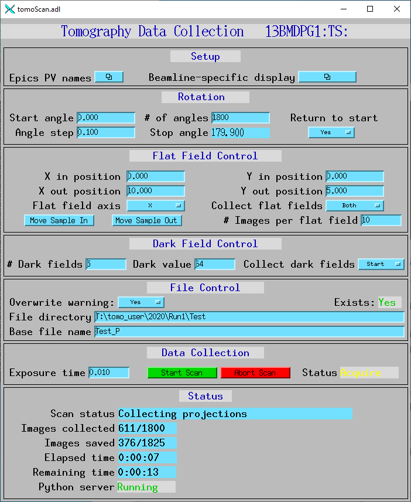
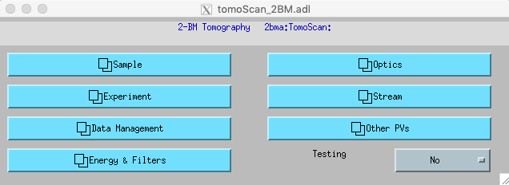
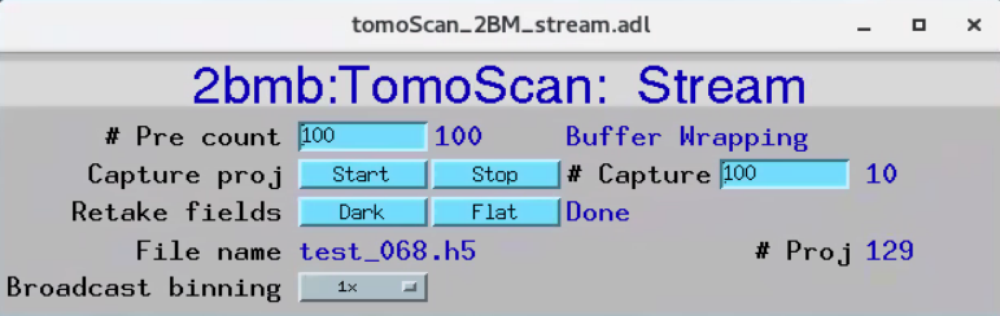
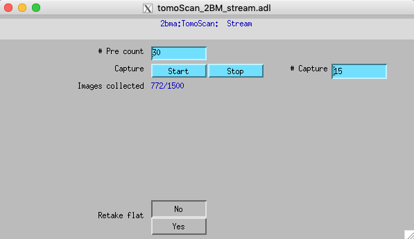
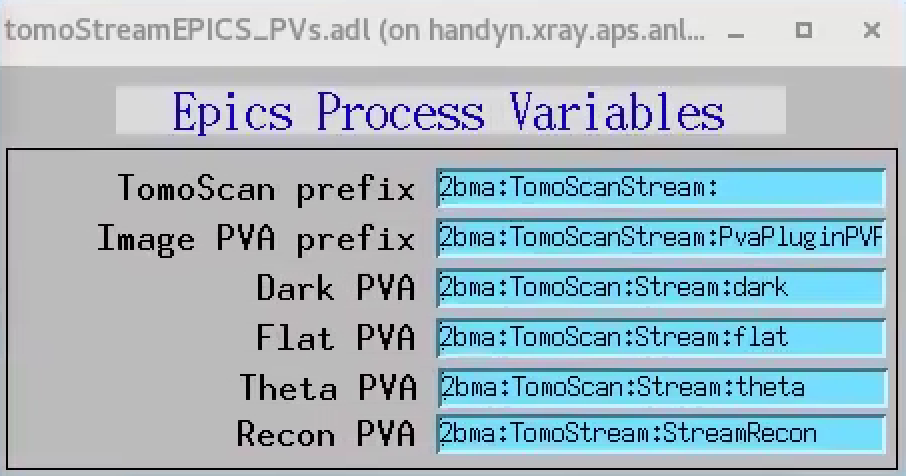
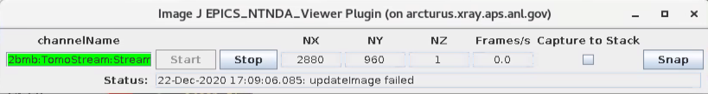
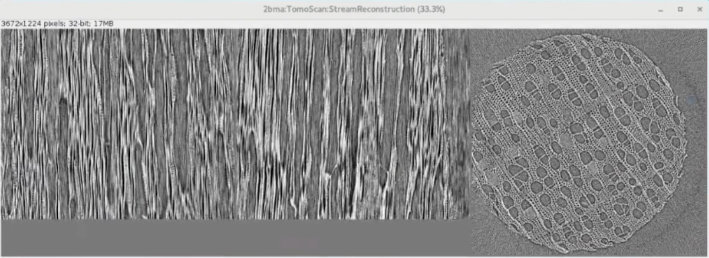

=====
Usage
=====

.. _areadetector: https://cars9.uchicago.edu/software/epics/areaDetector.html
.. _dxchange: https://dxfile.readthedocs.io/en/latest/source/xraytomo.html
.. _EPICS_NTNDA_Viewer: https://cars9.uchicago.edu/software/epics/areaDetectorViewers.html
.. _tomoScan: https://tomoscan.readthedocs.io
.. _tomoscan_stream_2bm: https://tomoscan.readthedocs.io/en/latest/api/tomoscan_stream_2bm.html

Using the tomoStream
--------------------

Pre-requisites
^^^^^^^^^^^^^^

Before running **tomostream** you need to install and run `tomoscan_stream_2bm`_ (see `tomoScan`_ for details) to provide:

- Tomography instrument control
- Projection, dark and flat image broadcast as PV access variables
- On-demand retake of dark-flat field images
- On-demand data capturing 

Once `tomoScan`_ is installed on the computer connected to the detector:

- start area detector, e.g.::

    user2bmb@lyra$  2bmbPG1 start

- start tomoScan IOC, e.g.::

    user2bmb@lyra$  cd /local/user2bmb/epics/synApps/support/tomoscan/iocBoot/iocTomoScan_2BM/
    user2bmb@lyra$  ./start_IOC

- start the instance of tomoscan.py supporting tomostream tasks at your beamline, e.g.::

    user2bmb@lyra$  cd /local/user2bmb/epics/synApps/support/tomoscan/iocBoot/iocTomoScan_2BM/
    user2bmb@lyra$  python -i start_tomoscan_stream.py

- start tomoScan user interface, e.g.::

    user2bmb@lyra$  cd /local/tomo/epics/synApps/support/tomostream/iocBoot/iocTomoStream/
    user2bmb@lyra$  ./start_medm

Open the EPICS PV names configuration screen:

and select Stream:

All `tomoscan_stream_2bm`_ functionalies supporting **tomostream** can be controlled from the tomoScan_2BM_stream user interface.

Run tomoStream
^^^^^^^^^^^^^^

- start tomoStream IOC, e.g.::

    tomo@handyn$  cd /local/tomo/epics/synApps/support/tomostream/iocBoot/iocTomoStream/
    tomo@handyn$  ./start_IOC

- start the tomostream.py supporting streaming reconstruction, e.g.::

    tomo@handyn$ cd /local/tomo/epics/synApps/support/tomostream/iocBoot/iocTomoStream/
    tomo@handyn$ python -i start_tomostream.py

- start tomoStream user interface, e.g.::

    tomo@handyn$ cd /local/tomo/epics/synApps/support/tomostream/iocBoot/iocTomoStream/
    tomo@handyn$ ./start_medm

Open the EPICS PV names configuration screen:

to set the TomoScan prefix and the PVAccess names provided by `tomoScan`_ for projection (Image), dark and flat image broadcast. Here also set the Recon PVAccess name where the streaming reconstruction will served. Use the Recon PVAccess name to view the live reconstriction using the `EPICS_NTNDA_Viewer`_ ImageJ plug-in:

Finally press "Start Scan" in the tomoScan control screen and reconstructions will diplay live in ImageJ:

