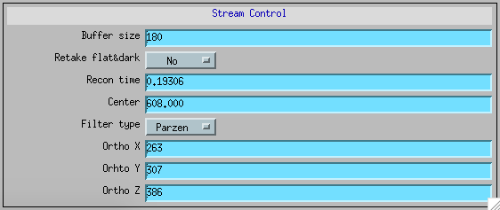
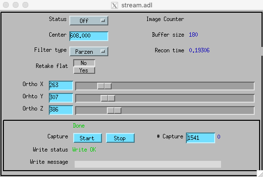

=====
Usage
=====

.. _areadetector: https://cars9.uchicago.edu/software/epics/areaDetector.html
.. _dxchange: https://dxfile.readthedocs.io/en/latest/source/xraytomo.html
.. _EPICS_NTNDA_Viewer: https://cars9.uchicago.edu/software/epics/areaDetectorViewers.html
.. _stream_control: https://tomoscan.readthedocs.io/en/latest/tomoScanApp.html#id7

Using the tomostream-cli
------------------------

On the computer running `areadetector`_ run::

    $ tomostream server

This command provides an EPICS PV containing flat and dark images collected at the beginning of the scan. These images are used by the streaming engine to perform the tomographic reconstruction and will also be saved in each raw data saving cycle so that the resulting data set will conform to the `dxchange`_ file format definition.

On the computer running the reconstruction run::

    $ tomostream recon

This command start the streaming reconstruction engine. The streaming reconstruction consists of 3 selectable X-Y-Z orthogonal planes and is available as an EPICS PV viewable in ImageJ using the `EPICS_NTNDA_Viewer`_ plug-in. The name this PV is set at start up time with::

    $ tomostream recon --recon-pva 2bma:TomoScan:StreamReconstruction

The streaming parameters are adjustable accessing the `stream_control`_ section of the tomoScan beamline specific medm screen.

Data saving can be enabled at any time during streaming by pressing "Capture" on the detector HDF plug-in.

For help::

    $ tomostream -h
    $ tomostream server -h
    $ tomostream recon -h

