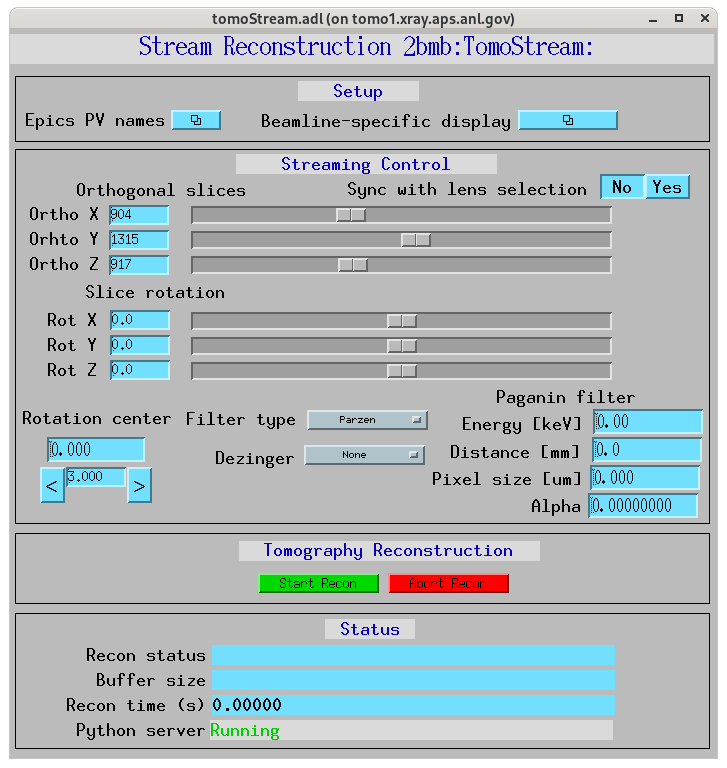

=====
Usage
=====

.. _areadetector: https://cars9.uchicago.edu/software/epics/areaDetector.html
.. _dxchange: https://dxfile.readthedocs.io/en/latest/source/xraytomo.html
.. _EPICS_NTNDA_Viewer: https://cars9.uchicago.edu/software/epics/areaDetectorViewers.html
.. _tomoScan: https://tomoscan.readthedocs.io
.. _tomoscan_stream_2bm: https://tomoscan.readthedocs.io/en/latest/api/tomoscan_stream_2bm.html

Using the tomoStream
--------------------

Pre-requisites
^^^^^^^^^^^^^^

Before running **tomostream** you need to install and run `tomoscan_stream_2bm`_ (see `tomoScan`_ for details) to provide:

- Tomography instrument control
- Projection, dark and flat image broadcast as PV access variables
- On-demand retake of dark-flat field images
- On-demand data capturing 

Once `tomoScan`_ is installed on the computer connected to the detector:

- start area detector, e.g.::

    2bmb@tomdet $ cd /net/s2dserv/xorApps/epics/synApps_6_3/ioc/2bmSpinnaker/iocBoot/ioc2bmSP2/softioc/
    2bmb@tomdet $ ./2bmSP2.pl run

- start tomoScanStream IOC, e.g.::

    2bmb@tomdet $  cd ~/epics/synApps/support/tomoscan/iocBoot/iocTomoScanStream_2BMB/
    2bmb@tomdet $  ./start_IOC

- start the instance of tomoScanStream python server, e.g.::

    2bmb@tomdet $  conda activate tomoscan
    2bmb@tomdet $  cd ~/epics/synApps/support/tomoscan/iocBoot/iocTomoScanStream_2BMB/
    2bmb@tomdet $  python -i start_tomoscan.py

- start tomoScanStream user interface, e.g.::

    2bmb@tomdet $  cd ~/epics/synApps/support/tomoscan/iocBoot/iocTomoScanStream_2BMB/
    2bmb@tomdet $  ./start_medm

Open the EPICS PV names configuration screen:

All `tomoscan_stream_2bm`_ functionalies supporting **tomostream** can be controlled from the tomoScanStream user interface marked in yellow.

Run tomoStream
^^^^^^^^^^^^^^

- start tomoStream IOC, e.g.::

    2bmb@tomo1 $  cd ~/epics/synApps/support/tomostream/iocBoot/iocTomoStream_2BM/
    2bmb@tomo1 $  ./start_IOC

- start the tomostream.py supporting streaming reconstruction, e.g.::

    2bmb@tomo1 $  conda activate tomostream
    2bmb@tomo1 $  cd ~/epics/synApps/support/tomostream/iocBoot/iocTomoStream_2BM/
    2bmb@tomo1 $ python -i start_tomostream.py

- start tomoStream user interface, e.g.::

    2bmb@tomo1 $  cd ~/epics/synApps/support/tomostream/iocBoot/iocTomoStream_2BM/
    2bmb@tomo1$ ./start_medm

Open the EPICS PV names configuration screen:

.. image:: img/tomoStream_02.png
    :width: 60%
    :align: center

to set the TomoScan prefix and the PVAccess names provided by `tomoScan`_ for projection (Image), dark and flat image broadcast. Here also set the Recon PVAccess name where the streaming reconstruction will served. Use the Recon PVAccess name to view the live reconstriction using the `EPICS_NTNDA_Viewer`_ ImageJ plug-in:

.. image:: img/EPICS_NTNDA_Viewer.png
    :width: 70%
    :align: center

Finally press "Start Scan" in the tomoScan control screen and reconstructions will diplay live in ImageJ:

.. image:: img/tomoStreamRecon.png
    :width: 70%
    :align: center

