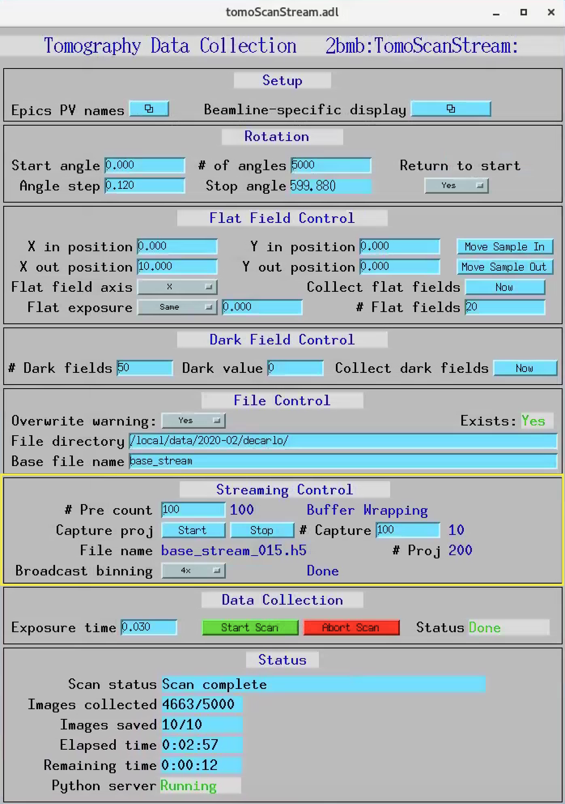

.. _tomoScan: https://tomoscan.readthedocs.io
.. _tomoscan_stream_2bm: https://tomoscan.readthedocs.io/en/latest/api/tomoscan_stream_2bm.html
.. _EPICS_NTNDA_Viewer: https://cars9.uchicago.edu/software/epics/areaDetectorViewers.html
.. _ImageJ: https://imagej.nih.gov/ij/

================
 About
================

**tomostream** is Python module for supporting streaming analysis of tomographic data where all pre-processing and reconstruction procedures are performed in real time while images are collected and the rotary stage is moving.  **tomostream** provides this main functionality:

- Streaming reconstruction of 3 X-Y-Z ortho-slices through the sample
    | The streaming reconstruction engine generates 3 selectable X-Y-Z orthogonal planes and makes them available as an EPICS PV viewable in ImageJ using the `EPICS_NTNDA_Viewer`_ plug-in. Projection, dark and flat images used for the reconstruction are taken in real time from a set of PV access variables (pvapy) and stored in a synchronized queue. On each reconstruction call new data are taken from the queue, copied to a circular GPU buffer containing projections for a 180 degrees interval, and then reconstructed.

All **tomostream** functionalies can be controlled from the tomoStream user interface:

.. image:: docs/source/img/tomoStream.png
    :width: 30%
    :align: center

**tomostream**  relies on `tomoscan_stream_2bm`_ (part of `tomoScan`_) for:

- Tomography instrument control
- Projection, dark and flat image broadcast as PV access variables
- On-demand retake of dark-flat field images
- On-demand data capturing 

All `tomoscan_stream_2bm`_ functionalies supporting **tomostream** can be controlled from the tomoScanStream user interface marked in yellow:

The output of **tomostream** is a live reconstruction diplaying in ImageJ using the `EPICS_NTNDA_Viewer`_ plug-in:

.. image:: docs/source/img/tomoStreamRecon.png
    :width: 30%
    :align: center
    
While the sample is rotating is possible to optimize instrument (alignment, focus, sample to detector distance etc.) and  beamline (energy etc.) conditions and monitor the effect live on the 3 orthogonal slices. It is also possible to automatically trigger data capturing based on events occurring in the sample and its environment as a result of segmentation or machine learning.

================
 Installation
================

.. _areadetector: https://cars9.uchicago.edu/software/epics/areaDetector.html

The computer performing the tomographic reconstruction must have CUDA/GPU installed. **tomostream** consists of two modules
TomoScanApp and tomostream tools.

TomoScanApp
===========

Provides all the EPICS PVs needed by **tomostream**. To install TomoScanApp follow these steps:

Build a minimal synApps
-----------------------

To build a minimal synApp::

    $ mkdir ~/epics
    $ cd epics

- Download in ~/epics `assemble_synApps <https://github.com/EPICS-synApps/support/blob/master/assemble_synApps.sh>`_.sh
- Edit the assemble_synApps.sh script as follows:
    - Set FULL_CLONE=True
    - Set EPICS_BASE to point to the location of EPICS base.  This could be on APSshare (the default), or a local version you built.
    - For tomostream you only need BUSY and AUTOSAVE.  You can comment out all of the other modules (ALLENBRADLEY, ALIVE, etc.)

- Run::

    $ assemble_synApps.sh

- This will create a synApps/ directory::

    $ cd synApps/support/

- Edit  busy-R1-7-2/configure/RELEASE to comment out this line::
    
    ASYN=$(SUPPORT)/asyn-4-32).

- Clone the tomostream module into synApps/support::
    
    $ git clone https://github.com/tomography/tomostream.git

- Edit tomostream/configure/RELEASE to comment out this line::
    
    ASYN=$(SUPPORT)/asyn-4-38

- Edit tomostream/tomoStreamApp/src/Makefile to comment out this line::
    
    tomoStreamApp_LIBS += asyn

- Edit configure/RELEASE add this line to the end::
    
    TOMOSTREAM=$(SUPPORT)/tomostream

- Edit Makefile add this line to the end of the MODULE_LIST::
    
    MODULE_LIST += TOMOSTREAM

- Run the following commands::

    $ make release
    $ make -sj

Testing the installation
------------------------

- Edit /epics/synApps/support/tomostream/configure
    - Set EPICS_BASE to point to the location of EPICS base:
    - EPICS_BASE=/APSshare/epics/base-3.15.6

- Start the epics ioc and associated medm screen with::

    $ cd ~/epics/synApps/support/tomostream/iocBoot/iocTomoStream
    $ start_IOC
    $ start_medm

tomostream python tools
=======================

::

    $ cd ~/epics/synApps/support/tomostream/
    $ python setup.py install

Testing the installation
------------------------

::

    $ cd ~/epics/synApps/support/tomostream/iocBoot/iocTomoStream
    $ python -i start_tomostream.py

================
 Developers
================
Viktor Nikitin (vnikitin@anl.gov)
